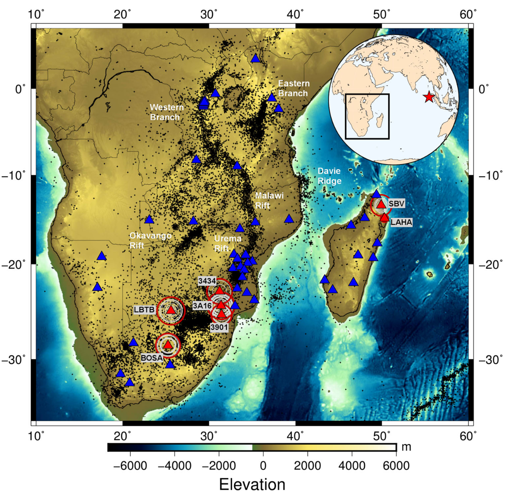
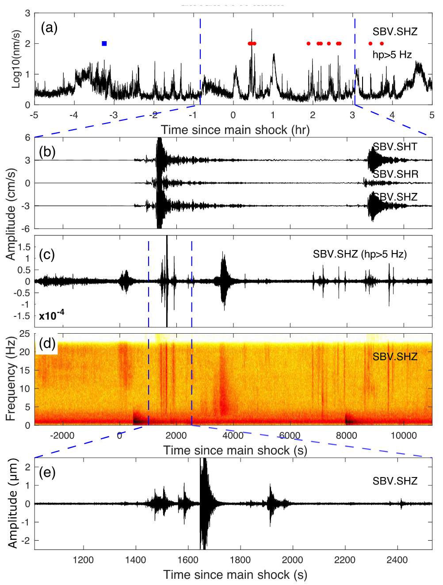

---

##### Download

+ [Paper](Neves_et_al_2018_Earthquake_triggering_in_southeast_Africa_following_the_2012_Indian_Ocean.pdf)
<!---
+ [Online appendix](appendix1.pdf)
%+ [Code and data](https://github.com/pmichaillat/job-rationing)
--->

---

##### Abstract

In this paper we present evidence of earthquake dynamic triggering in southeast Africa. We analysed seismic waveforms recorded at 53 broad-band and short-period stations in order to identify possible increases in the rate of microearthquakes and tremor due to the passage of teleseismic waves generated by the Mw8.6 2012 Indian Ocean earthquake. We found evidence of triggered local earthquakes and no evidence of triggered tremor in the region. We assessed the statistical significance of the increase in the number of local earthquakes using β-statistics. Statistically significant dynamic triggering of local earthquakes was observed at 7 out of the 53 analysed stations. Two of these stations are located in the northeast coast of Madagascar and the other five stations are located in the Kaapvaal Craton, southern Africa. We found no evidence of dynamically triggered seismic activity in stations located near the structures of the East African Rift System. Hydrothermal activity exists close to the stations that recorded dynamic triggering, however, it also exists near the East African Rift System structures where no triggering was observed. Our results suggest that factors other than solely tectonic regime and geothermalism are needed to explain the mechanisms that underlie earthquake triggering.

---

##### Figure 1: Map of central and south Africa. The small ‘+’ mark the seismicity from 1901 to 2016 (International Seismological Centre 2016). The seismicity clearly defines the structures of the EARS. Clusters of earthquakes in South Africa result both from natural and anthropogenic causes. Blue triangles represent the stations where no significant increase in activity was found. Red triangles represent the stations where remotely triggered earthquakes were observed: two stations in the northeast coast of Madagascar and five stations around one of the South Africa most active clusters. Circles around these stations mark the possible locations of triggered earthquakes computed from S–P time differences; green and red circles mark the shortest and most distant circles for each station. The location of the Mw8.6 2012 Indian Ocean earthquake (red star) relative to the study area (black square) is shown in the top right inset map.



---

##### Figure 3: Remote dynamic triggering at station SBV in Madagascar. (a) Envelope of the high-pass filtered (≥5 Hz) vertical velocity recorded in the 6 hr before and after the 2012 Mw8.6 Indian Ocean main shock. Blue squares mark picked events before the instantaneous triggering window and red circles picked events in the triggering windows. (b) Transverse, radial and vertical seismograms during the passage of the main shock and Mw8.2 aftershock. (c) High-pass filtered ≥5 Hz velocity waveform (same time window as in (b). (d) Spectrogram of the vertical velocity waveform (same time window as in (b). (e) Zoom of the band-passed velocity waveform (shown in c) around the time of the main shock surface waves.



---

##### Citation

Miguel Neves, Susana Custódio, Zhigang Peng, Adebayo Ayorinde, Earthquake triggering in southeast Africa following the 2012 Indian Ocean earthquake, Geophysical Journal International, Volume 212, Issue 2, February 2018, Pages 1331–1343, https://doi.org/10.1093/gji/ggx462

```BibTeX
@article{10.1093/gji/ggx462,
    author = {Neves, Miguel and Custódio, Susana and Peng, Zhigang and Ayorinde, Adebayo},
    title = "{Earthquake triggering in southeast Africa following the 2012 Indian Ocean earthquake}",
    journal = {Geophysical Journal International},
    volume = {212},
    number = {2},
    pages = {1331-1343},
    year = {2017},
    issn = {0956-540X},
    doi = {10.1093/gji/ggx462},
    url = {https://doi.org/10.1093/gji/ggx462},
}
```

<!---
---

##### Related material

+ [Presentation slides](presentation1.pdf)
+ [Dissertation title](https://escholarship.org/uc/item/7jr3m96r) – PhD dissertation on which this paper is based.
+ [Column title](https://cep.lse.ac.uk/pubs/download/cp365.pdf) – Nontechnical column describing the paper.
--->

