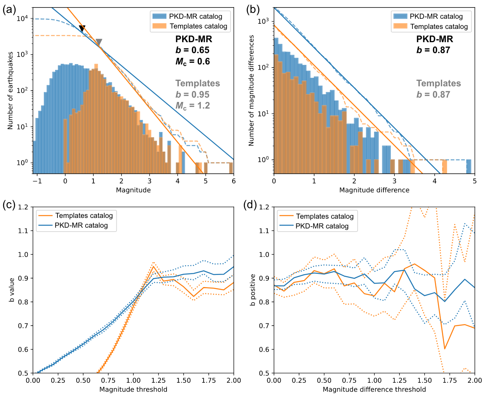

---

##### Download

+ [Paper](parkfield_catalog_manuscript_final1.pdf)
<!---
+ [Online appendix](appendix2.pdf)
+ [Code and data](https://github.com/pmichaillat/unemployment-gap)
--->
---

##### Abstract

We present the high-resolution Parkfield matched filter relocated earthquake (PKD-MR) catalog for the 2004 Mw 6 Parkfield earthquake sequence in central California. We use high-quality seismic data recorded by the borehole High Resolution Seismic Network combined with matched filter detection and relocations from cross-correlation derived differential travel times. We determine the magnitudes of newly detected events by computing the amplitude ratio between the detections and templates using a principal component fit. The relocated catalog spans from 6 November 2003 to 28 March 2005 and contains 13,914 earthquakes, which is about three times the number of events listed in the Northern California Seismic Network catalog. Our results on the seismicity rate changes before the 2004 mainshock do not show clear precursory signals, although we find an increase in the seismic activity in the creeping section of the San Andreas fault (SAF) (about ∼ 30 km northwest of the mainshock epicenter) in the weeks prior to the mainshock. We also observe a decrease in the b-value parameter in the GutenbergRichter relationship in the creeping section in the weeks prior to the mainshock. Our results suggest stress is increasingly released seismically in the creeping section, accompanied by a decreasing aseismic creeping rate before the mainshock occurrence. However, b-value and seismicity rates remain stable in the Parkfield section where the 2004 mainshock ruptured. This updated catalog can be used to study the evolution of aftershocks and their relations to afterslip following the 2004 Parkfield mainshock, seismicity before the mainshock, and how external stresses interact with the Parkfield section of the SAF and the 2004 sequence.

---

##### Figure 2.c: Plot of earthquake magnitudes with time for the entire Parkfield segment and each of the fault sections. Vertical lines mark the times of three major earthquakes during the study period.


---

##### Figure 5: (a) Gutenberg–Richter distribution of the template catalog (orange) and the new relocated catalog (blue). b-value maximum likelihood and AMC estimates are denoted in gray and black for the template and the new catalog, respectively. (b) Distribution of positive magnitude differences above AMC. bpositive maximum-likelihood estimates are denoted in gray and black for the template and the new catalog, respectively. (c) Variation of b-value estimates with assumed magnitude of completeness. Uncertainties are estimated by bootstrapping. (d) Variation of b-positive estimates with assumed minimum magnitude difference.



---

##### Figure 6: Variation of β-statistics at the studied period using two 30-day moving windows and our new PKD-MR catalog. (a) Three panels show variations considering the entire Parkfield segment and the different sections of the fault. (b) Detailed view of the 50 days prior to the mainshock.


---

##### Figure 7: Time variations of b-value using the b-positive estimator. (a) Shows variations for the Parkfield segment and the creeping and Parkfield sections. Gray-shaded areas indicate periods in which most High Resolution Seismic Network stations do not have complete daily records. (b) Shows estimates for the entire Northern California Seismic Network catalog. Color bars at the top in (a) and bottom in (b) show identified periods of significant b-positive changes using our slope analysis, in which red corresponds to significant increases, blue to significant decreases, and gray to no significant changes.


---

##### Citation

Miguel Neves, Zhigang Peng, Guoqing Lin; A High‐Resolution Earthquake Catalog for the 2004 6 Parkfield Earthquake Sequence Using a Matched Filter Technique. *Seismological Research Letters* 2022; 94 (1): 507–521. doi: https://doi.org/10.1785/0220220206.

```BibTeX
@article{10.1785/0220220206,
    author = {Neves, Miguel and Peng, Zhigang and Lin, Guoqing},
    title = "{A High‐Resolution Earthquake Catalog for the 2004 Mw 6 Parkfield Earthquake Sequence Using a Matched Filter Technique}",
    journal = {Seismological Research Letters},
    volume = {94},
    number = {1},
    pages = {507-521},
    year = {2022},
    issn = {0895-0695},
    doi = {10.1785/0220220206},
    url = {https://doi.org/10.1785/0220220206},
}
```

<!---
---

##### Related material

+ [Presentation slides](presentation2.pdf)
--->
